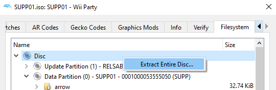

Wii Party
=============

A work-in-progress decompilation of Wii Party.

All versions of the game are supported (with PAL as the default):

- `SUPJ01-R0`: Rev 0 (JPN)
- `SUPJ01-R1`: Rev 1 (JPN)
- `SUPP01`: Rev 0 (PAL)
- `SUPE01`: Rev 0 (USA)
- `SUPK01`: Rev 0 (KOR)

Dependencies
============

Windows:
--------

On Windows, it's **highly recommended** to use native tooling. WSL or msys2 are **not** required.  
When running under WSL, [objdiff](#diffing) is unable to get filesystem notifications for automatic rebuilds.

- Install [Python](https://www.python.org/downloads/) and add it to `%PATH%`.
  - Also available from the [Windows Store](https://apps.microsoft.com/store/detail/python-311/9NRWMJP3717K).
- Download [ninja](https://github.com/ninja-build/ninja/releases) and add it to `%PATH%`.
  - Quick install via pip: `pip install ninja`

macOS:
------
- Install [ninja](https://github.com/ninja-build/ninja/wiki/Pre-built-Ninja-packages):
  ```
  brew install ninja
  ```
- Install [wine-crossover](https://github.com/Gcenx/homebrew-wine):
  ```
  brew install --cask --no-quarantine gcenx/wine/wine-crossover
  ```

After OS upgrades, if macOS complains about `Wine Crossover.app` being unverified, you can unquarantine it using:
```sh
sudo xattr -rd com.apple.quarantine '/Applications/Wine Crossover.app'
```

Linux:
------
- Install [ninja](https://github.com/ninja-build/ninja/wiki/Pre-built-Ninja-packages).
- For non-x86(_64) platforms: Install wine from your package manager.
  - For x86(_64), [WiBo](https://github.com/decompals/WiBo), a minimal 32-bit Windows binary wrapper, will be automatically downloaded and used.

Building
========

- Clone the repository:
  ```
  git clone https://github.com/InputEvelution/wp.git
  ```
- Using [Dolphin Emulator](https://dolphin-emu.org/), extract your game to `orig/SUPP01` (or `SUPJ01-R0` for JPN r0, `SUPE01` for USA, etc.).  

  - To save space, the only necessary files are the following. Any others can be deleted.
    - `sys/main.dol`
    - `files/rel/*.rel.lz`
- Configure:
  ```
  python configure.py
  ```
  To use a version other than `SUPP01` (PAL), specify `--version SUPJ01-R0` (JPN r0), `--version SUPJ01-R1` (JPN r1), `--version SUPE01` (USA), or `--version SUPK01` (KOR).
- Build:
  ```
  ninja
  ```
